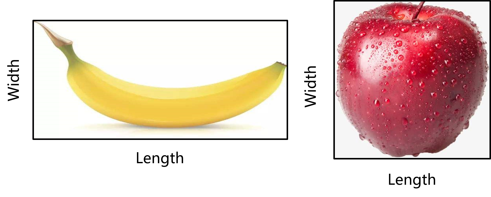
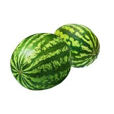
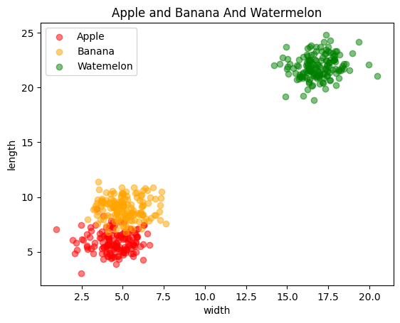

# Assignment 41
# Machine learning

# Classification whit KNN algorithm
This project includes a K-Nearest Neighbors (KNN) model used for classifying different types of fruits (apple, banana, and watermelon).
### Description
In this project, we use the KNN model to classify three types of fruits (apple, banana, and watermelon). The model is trained on the features of the fruit data and then used to predict the type of new fruits.

# classification

classification is the process of grouping objects.

## How to Install
Run following commend :
```
pip install -r requirments.txt
```

## How to Run
```
Run KNN.ipynb file in jupyter notebook
```

## Input




## Results

The Diagram of fruits with new three data:




-----------------------------------------


